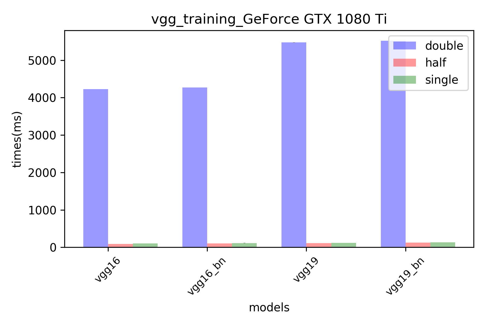
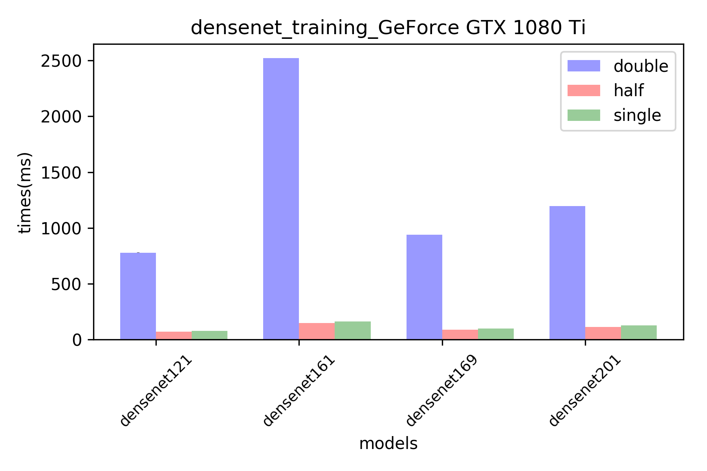
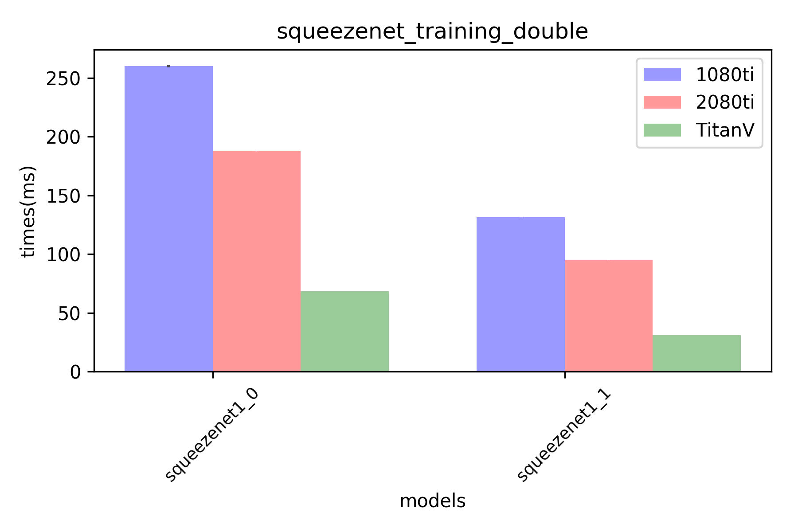

# About
Comparison of learning and inference speed of different gpu with various cnn models in __pytorch__

* 1080TI
* TITAN V
* 2080TI

# Specification

|Graphics Card Name|NVIDIA GeForce GTX 1080 Ti|NVIDIA GeForce RTX 2080 Ti|NVIDIA TITAN V
|:-------:|:-------:|:-------:|:-------:|
|Process|16nm|12nm|12nm|
|Die Size|471mm²|754mm²|815mm²|
|Transistors|11,800 million|18,600 million|21,100 million|
|CUDA Cores|3584 Cores|4352 Cores|5120 Cores|
|Tensor Cores|None|544 Cores|640 Cores|
|Clock(base)|1481 MHz|1350 MHz|1200 MHz|
|FP16 (half) performance|177.2 GFLOPS|26,895 GFLOPS|29,798 GFLOPS|
|FP32 (float) performance|11,340 GFLOPS|13,448 GFLOPS|14,899 GFLOPS|
|FP64 (double) performance|354.4 GFLOPS |420.2 GFLOPS|7,450 GFLOPS|
|Memory|11GB GDDR5X|11 GB GDDR6|12 GB HBM2|
|Memory Speed|11Gbps|14.00 Gbps|1.7Gbps HBM2|
|Memory Interface|352-bit|352-bit|3072-bit|
|Memory Bandwidth|484 GB/s|616 GB/s|653GB/s|
|Price|$699 US|$1,199 US|$2,999 US|
|Release Date|Mar 10th, 2017|Sep 20th, 2018|Dec 7th, 2017|

[_reference site_](https://www.techpowerup.com/gpu-specs/)

1. Single GPU with batch size 16: compare training and inference speed of **SequeezeNet, VGG-16, VGG-19, ResNet18, ResNet34, ResNet50, ResNet101,
ResNet152, DenseNet121, DenseNet169, DenseNet201, DenseNet161**

2. Experiments are performed on three types of datatype. single precision, double precision, half precision

3. making plot

## Usage

`./test.sh`

## Results

###  requirement
* python3-tk
* matplotlib
* pandas
* PyTorch
* torchvision

### Environment

* Pytorch version `1.0.0a0+2cbcaf4`
* Number of GPUs on current device `1`
* CUDA version = `10.0.130`
* CUDNN version= `7301`

### Comparison between networks (single GPU)

Each network is fed with 12 images with 224x224x3 dimensions.
For training, time durations of 20 passes of forward and backward are averaged. For inference, time durations of
20 passes of forward are averaged. 5 warm up steps are performed that do not calculate towards the final result.

_I conducted the experiment using two rtx 2080ti._

|   Mode  |gpu|precision|densenet121|densenet161|densenet169|densenet201|resnet101|resnet152|resnet18|resnet34|resnet50|squeezenet1_0|squeezenet1_1|vgg16|vgg16_bn|vgg19|vgg19_bn|
|:-------:| :----:|:--:|:----------:|:-------:|:-----------:|:-------:|:---------:| ---------:|:-----:|:---------:|:-----:|:------:|:---------:|:-------:|:---------:|:-------:|:---------:|
|Training | TITAN V|single|56.17 ms|120.7 ms|72.59 ms|93.35 ms|84.59 ms|119.5 ms|16.69 ms|28.27 ms|50.54 ms|15.30 ms|9.857 ms|72.85 ms|80.95 ms|85.55 ms|94.42 ms|
|Inference| TITAN V|single|17.49 ms|39.33 ms|23.63 ms|30.93 ms|23.96 ms|34.22 ms|4.827 ms|8.428 ms|14.27 ms|4.565 ms|2.765 ms|22.94 ms|25.41 ms|27.55 ms|30.28 ms|
|Training | TITAN V|double|139.8 ms|387.4 ms|175.9 ms|224.5 ms|509.9 ms|720.0 ms|94.21 ms|194.6 ms|271.7 ms|68.38 ms|31.18 ms|1463. ms|1484. ms|1993. ms|2016. ms|
|Inference| TITAN V|double|47.68 ms|170.5 ms|60.73 ms|78.43 ms|317.7 ms|448.6 ms|60.26 ms|129.9 ms|159.8 ms|42.37 ms|11.95 ms|1261. ms|1266. ms|1745. ms|1751. ms|
|Training | TITAN V|half|43.79 ms|75.16 ms|57.53 ms|70.88 ms|47.82 ms|67.43 ms|10.48 ms|17.19 ms|29.08 ms|13.15 ms|9.390 ms|36.03 ms|46.84 ms|41.16 ms|52.65 ms|
|Inference| TITAN V|half|11.87 ms|22.88 ms|16.04 ms|20.70 ms|12.80 ms|18.11 ms|3.085 ms|5.116 ms|7.608 ms|3.694 ms|2.329 ms|10.96 ms|13.26 ms|12.72 ms|15.17 ms|
|Training | 1080ti|single|77.18 ms|164.0 ms|99.66 ms|127.6 ms|112.8 ms|158.7 ms|22.48 ms|36.80 ms|68.87 ms|20.56 ms|13.29 ms|101.8 ms|114.1 ms|119.9 ms|133.2 ms|
|Inference| 1080ti|single|23.53 ms|51.53 ms|31.82 ms|41.73 ms|33.02 ms|47.02 ms|6.426 ms|10.97 ms|20.17 ms|7.174 ms|4.370 ms|33.73 ms|37.25 ms|39.95 ms|44.12 ms|
|Training | 1080ti|double|779.5 ms|2522. ms|940.4 ms|1196. ms|2410. ms|3546. ms|463.3 ms|969.9 ms|1216. ms|259.9 ms|131.5 ms|4227. ms|4271. ms|5475. ms|5522. ms|
|Inference| 1080ti|double|47.68 ms|275.2 ms|1157. ms|328.6 ms|414.9 ms|1080. ms|1589. ms|181.1 ms|390.8 ms|529.6 ms|110.9 ms|49.96 ms|2094. ms|2103. ms|2775. ms|2784. ms|
|Training | 1080ti|half|43.79 ms|70.00 ms|148.4 ms|89.43 ms|113.6 ms|151.0 ms|219.5 ms|21.00 ms|34.84 ms|76.24 ms|19.60 ms|13.18 ms|91.60 ms|105.9 ms|108.1 ms|123.6 ms|
|Inference| 1080ti|half|18.62 ms|42.26 ms|25.27 ms|33.01 ms|27.49 ms|38.88 ms|5.645 ms|9.765 ms|16.26 ms|5.869 ms|3.576 ms|30.69 ms|33.22 ms|36.71 ms|39.51 ms|

|   Mode  |gpu|precision|resnet18 |resnet34 |resnet50 |resnet101 |resnet152 |densenet121 |densenet169 |densenet201 |densenet161 |squeezenet1_0 |squeezenet1_1 |vgg16 |vgg16_bn |vgg19_bn |vgg19 |
|:-------:| :----:|:--:|:----------:|:-------:|:-----------:|:-------:|:---------:| ---------:|:-----:|:---------:|:-----:|:------:|:---------:|:-------:|:---------:|:-------:|:---------:|
|Training | RTX 2080ti(1)|single|16.36 ms|28.44 ms|49.63 ms|81.40 ms|115.1 ms|57.69 ms|75.18 ms|91.69 ms|112.7 ms|14.49 ms|9.108 ms|75.86 ms|85.42 ms|98.43 ms|88.05 ms|
|Inference| RTX 2080ti(1)|single|4.894 ms|8.624 ms|14.65 ms|24.57 ms|35.15 ms|16.70 ms|21.94 ms|28.89 ms|34.64 ms|4.704 ms|2.765 ms|23.70 ms|26.25 ms|30.82 ms|28.03 ms|
|Training | RTX 2080ti(1)|double|367.9 ms|755.4 ms|939.9 ms|1844. ms|2702. ms|593.5 ms|724.3 ms|921.3 ms|1916. ms|187.8 ms|94.99 ms|3251. ms|3277. ms|4265. ms|4238. ms|
|Inference| RTX 2080ti(1)|double|165.0 ms|328.5 ms|436.4 ms|831.0 ms|1196. ms|213.8 ms|266.0 ms|339.5 ms|910.7 ms|82.71 ms|35.79 ms|1702. ms|1708. ms|2280. ms|2274. ms|
|Training | RTX 2080ti(1)|half|13.17 ms|22.25 ms|35.46 ms|57.50 ms|81.38 ms|51.11 ms|66.88 ms|80.20 ms|88.37 ms|17.87 ms|35.75 ms|53.16 ms|63.06 ms|72.75 ms|61.95 ms|
|Inference| RTX 2080ti(1)|half|3.423 ms|5.662 ms|9.035 ms|14.51 ms|20.52 ms|13.47 ms|17.54 ms|22.51 ms|27.10 ms|4.280 ms|2.397 ms|16.14 ms|18.14 ms|19.76 ms|17.89 ms|
|Training | RTX 2080ti(2)|single|16.92 ms|29.51 ms|51.46 ms|84.90 ms|120.0 ms|58.13 ms|75.96 ms|92.47 ms|117.6 ms|14.95 ms|9.255 ms|78.95 ms|88.71 ms|102.3 ms|91.67 ms|
|Inference| RTX 2080ti(2)|single|5.107 ms|8.976 ms|15.18 ms|25.60 ms|36.60 ms|17.02 ms|22.40 ms|29.46 ms|36.72 ms|4.852 ms|2.786 ms|24.76 ms|27.25 ms|32.05 ms|29.27 ms|
|Training | RTX 2080ti(2)|double|381.9 ms|781.5 ms|971.6 ms|1900. ms|2777. ms|610.6 ms|744.7 ms|948.1 ms|1974. ms|191.9 ms|97.27 ms|3317. ms|3350. ms|4357. ms|4329. ms|
|Inference| RTX 2080ti(2)|double|171.8 ms|341.7 ms|449.5 ms|849.5 ms|1231. ms|221.1 ms|275.2 ms|352.5 ms|938.9 ms|83.66 ms|36.48 ms|1715. ms|1721. ms|2294. ms|2289. ms|
|Training | RTX 2080ti(2)|half|13.57 ms|22.97 ms|36.55 ms|59.10 ms|83.81 ms|51.74 ms|68.35 ms|81.21 ms|89.46 ms|15.75 ms|35.46 ms|55.28 ms|65.43 ms|75.75 ms|64.62 ms|
|Inference| RTX 2080ti(2)|half|3.520 ms|5.837 ms|9.272 ms|14.93 ms|21.13 ms|13.38 ms|18.71 ms|22.40 ms|26.82 ms|4.446 ms|2.406 ms|16.29 ms|17.91 ms|20.90 ms|19.14 ms|

## TitanV

### inference

### training

## GTX 1080ti

### inference

### training

## RTX2080 TI

### inference

/total.png)
/resnet.png)
/vgg.png)
/squeezenet.png)
/densenet.png)

### training

/resnet_training.png)
/vgg_training.png)
/squeezenet_training.png)
/densenet_training.png)

## Device comparison

### Training

#### Vgg

##### Single

##### Half

##### Double

#### ResNet

##### Single

##### Half

##### Double

#### DenseNet

##### Single

##### Half

##### Double

#### SqueezeNet

##### Single

##### Half

##### Double

### inference

#### Vgg

##### Single

##### Half

##### Double

#### ResNet

##### Single

##### Half

##### Double

#### DenseNet

##### Single

##### Half

##### Double

#### SqueezeNet

##### Single

##### Half

##### Double

