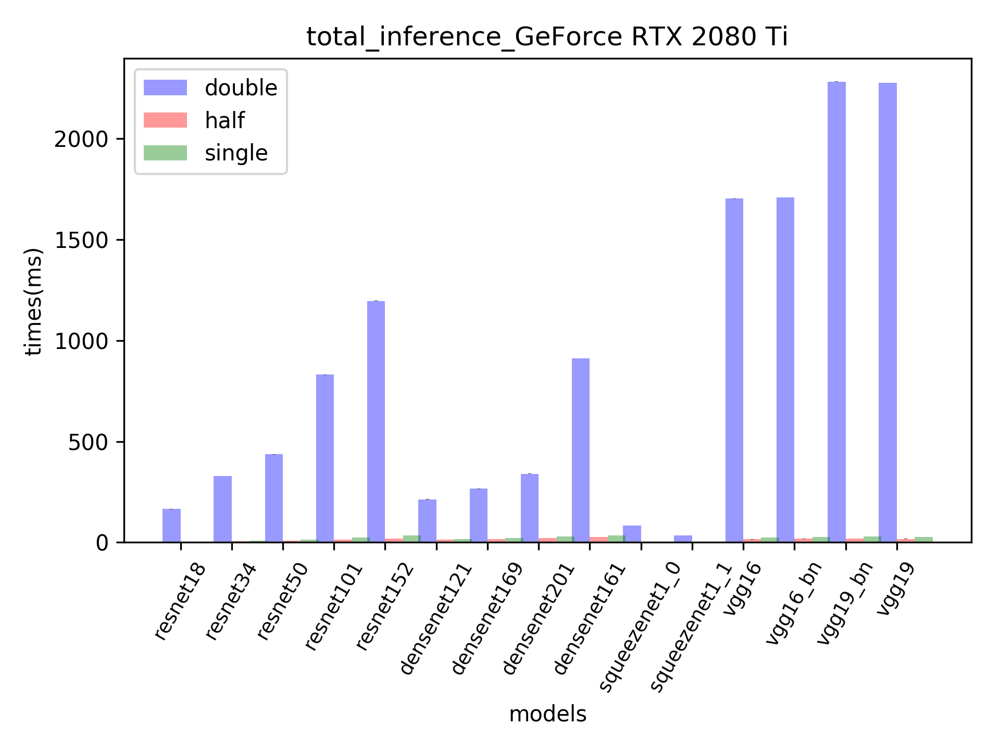
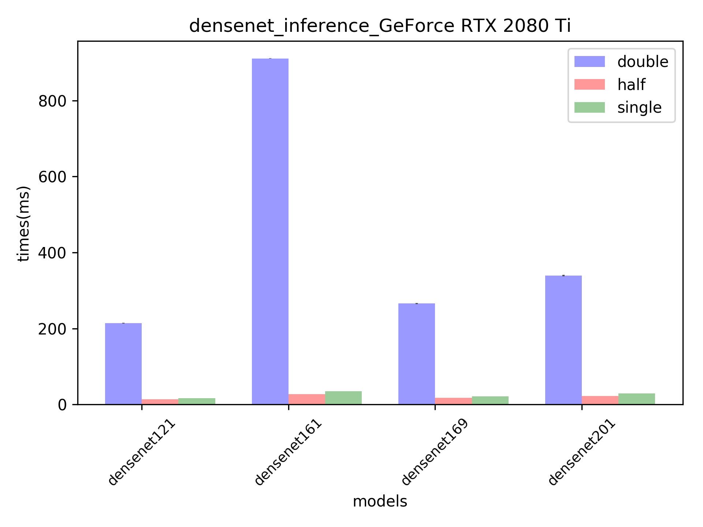
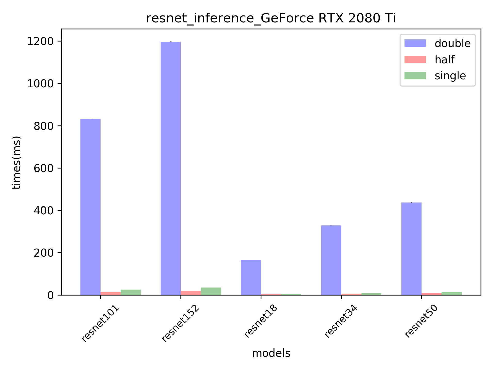
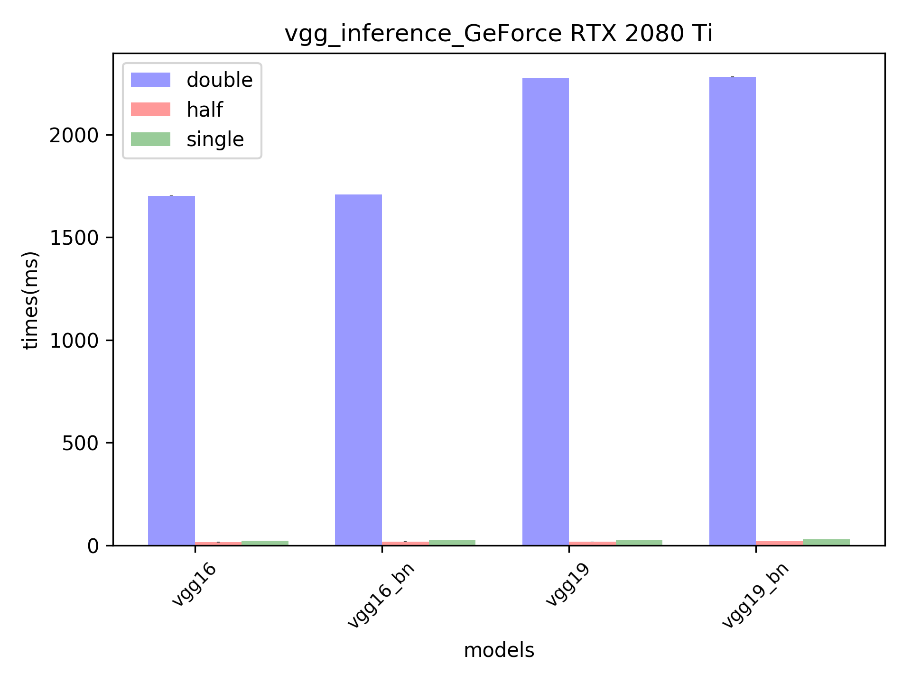
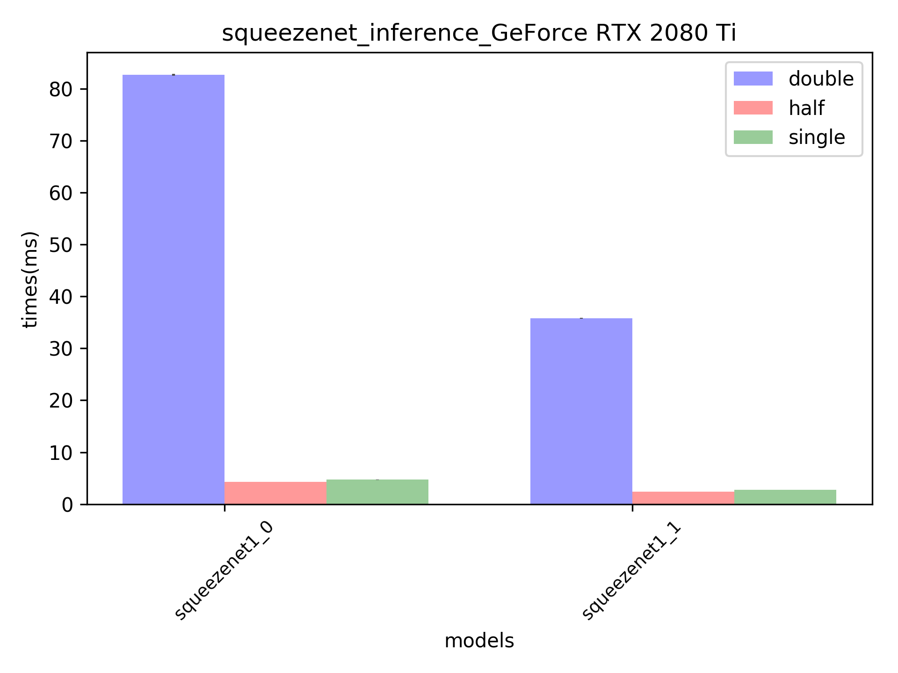
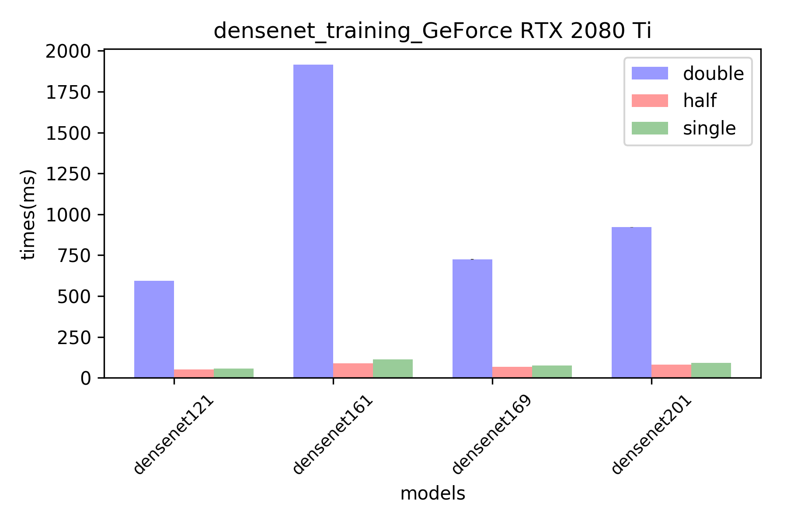
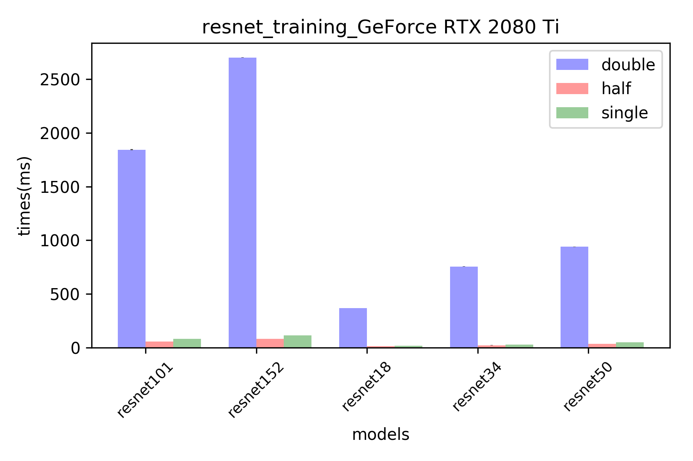
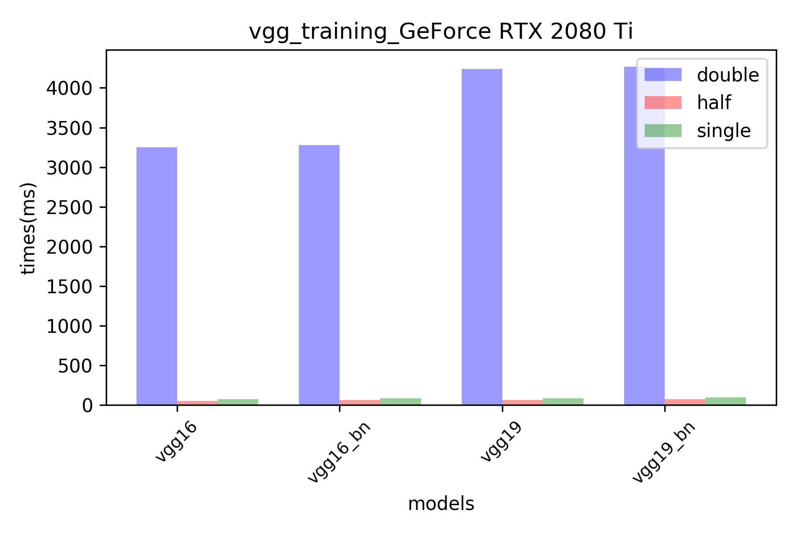
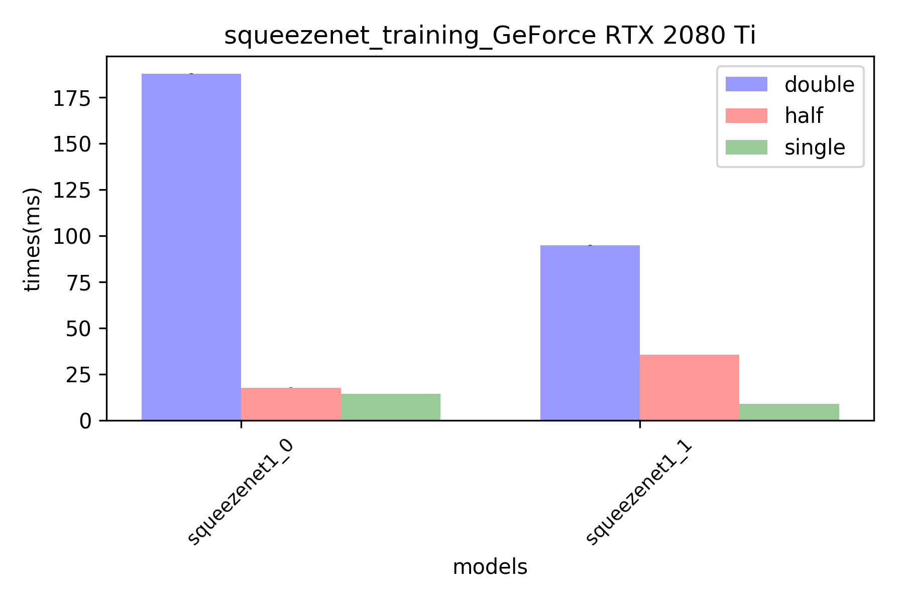

<table border="5" bordercolor="black" align="center">
    <tr>
        <th colspan="1"> <h2>TitanV Total</h2></th> 
    </tr>
    <tr>
       <td></img></th>
 </tr>

</table>

<table border="5" bordercolor="black" align="center">
    <tr>
        <th colspan="2"> <h2>TitanV inference</h2></th> 
    </tr>
    <tr>
        <td align="center"><bold>densenet</bold></td>
        <td align="center"><bold>resnet</bold></td>
    </tr>
    <tr>
       <td></img></th>
        <td></img></th>
    </tr>
    <tr>
    </tr>
    <tr>
        <td align="center"><bold>vgg</bold></td>
        <td align="center"><bold>squeezenet</bold></td>
    </tr>
    <tr>
         <td></img></th>
        <td></img></th>
    </tr>

</table>

  

<table border="5" bordercolor="black" align="center">
    <tr>
        <th colspan="2"> <h2> TitanV Training </h2></th> 
    </tr>
    <tr>
        <td align="center"><bold>densenet</bold></td>
        <td align="center"><bold>resnet</bold></td>
    </tr>
    <tr>
        <td></img></th>
        <td></img></th>
    </tr>
    <tr>
    </tr>
    <tr>
        <td align="center"><bold>vgg</bold></td>
        <td align="center"><bold>squeezenet</bold></td>
    </tr>
    <tr>
         <td></img></th>
        <td></img></th>
    </tr>
</table>

  

<table border="5" bordercolor="black" align="center">
    <tr>
        <th colspan="1"> <h2>1080ti Total</h2></th> 
    </tr>
    <tr>
       <td></img></th>
 </tr>

</table>

<table border="5" bordercolor="black" align="center">
    <tr>
        <th colspan="2"> <h2>1080ti inference</h2></th> 
    </tr>
    <tr>
        <td align="center"><bold>densenet</bold></td>
        <td align="center"><bold>resnet</bold></td>
    </tr>
    <tr>
       <td></img></th>
        <td></img></th>
    </tr>
    <tr>
    </tr>
    <tr>
        <td align="center"><bold>vgg</bold></td>
        <td align="center"><bold>squeezenet</bold></td>
    </tr>
    <tr>
         <td></img></th>
        <td></img></th>
    </tr>

</table>

  

<table border="5" bordercolor="black" align="center">
    <tr>
        <th colspan="2"> <h2> 1080ti Training </h2></th> 
    </tr>
    <tr>
        <td align="center"><bold>densenet</bold></td>
        <td align="center"><bold>resnet</bold></td>
    </tr>
    <tr>
        <td></img></th>
        <td></img></th>
    </tr>
    <tr>
    </tr>
    <tr>
        <td align="center"><bold>vgg</bold></td>
        <td align="center"><bold>squeezenet</bold></td>
    </tr>
    <tr>
         <td></img></th>
        <td></img></th>
    </tr>
</table>

  

<table border="5" bordercolor="black" align="center">
    <tr>
        <th colspan="1"> <h2>rtx2080ti Total</h2></th> 
    </tr>
    <tr>
       <td></img></th>
 </tr>

</table>

<table border="5" bordercolor="black" align="center">
    <tr>
        <th colspan="2"> <h2>rtx2080ti inference</h2></th> 
    </tr>
    <tr>
        <td align="center"><bold>densenet</bold></td>
        <td align="center"><bold>resnet</bold></td>
    </tr>
    <tr>
       <td></img></th>
        <td></img></th>
    </tr>
    <tr>
    </tr>
    <tr>
        <td align="center"><bold>vgg</bold></td>
        <td align="center"><bold>squeezenet</bold></td>
    </tr>
    <tr>
         <td></img></th>
        <td></img></th>
    </tr>

</table>

  

<table border="5" bordercolor="black" align="center">
    <tr>
        <th colspan="2"> <h2> rtx2080ti Training </h2></th> 
    </tr>
    <tr>
        <td align="center"><bold>densenet</bold></td>
        <td align="center"><bold>resnet</bold></td>
    </tr>
    <tr>
        <td></img></th>
        <td></img></th>
    </tr>
    <tr>
    </tr>
    <tr>
        <td align="center"><bold>vgg</bold></td>
        <td align="center"><bold>squeezenet</bold></td>
    </tr>
    <tr>
         <td></img></th>
        <td></img></th>
    </tr>
</table>

  
<table border="5" bordercolor="black" align="center">
    <tr>
        <th colspan="3"> <h2> Device comparison(Training) </h2></th> 
    </tr>
    <tr>
        <th colspan="3" align="center"> <bold>VGG </bold></th> 
    </tr>
    <tr>
        <td align="center"><bold>half</bold></td>
        <td align="center"><bold>single</bold></td>
        <td align="center"><bold>double</bold></td>
    </tr>
    <tr>
        <td></img></th>
        <td></img></td>
        <td></img></td>
    </tr>
        <tr>
        <th colspan="3" align="center"> <bold>resnet </bold></th> 
    </tr>
    <tr>
        <td align="center"><bold>half</bold></td>
        <td align="center"><bold>single</bold></td>
        <td align="center"><bold>double</bold></td>
    </tr>
    <tr>
        <td></img></th>
        <td></img></td>
        <td></img></td>
    </tr>
        <tr>
        <th colspan="3" align="center"> <bold>densenet </bold></th> 
    </tr>
    <tr>
        <td align="center"><bold>half</bold></td>
        <td align="center"><bold>single</bold></td>
        <td align="center"><bold>double</bold></td>
    </tr>
    <tr>
        <td></img></th>
        <td></img></td>
        <td></img></td>
    </tr>
            <th colspan="3" align="center"> <bold>squeezenet </bold></th> 
    </tr>
    <tr>
        <td align="center"><bold>half</bold></td>
        <td align="center"><bold>single</bold></td>
        <td align="center"><bold>double</bold></td>
    </tr>
    <tr>
        <td></img></th>
        <td></img></td>
        <td></img></td>
    </tr>
</table>

  

  
<table border="5" bordercolor="black" align="center">
    <tr>
        <th colspan="3"> <h2> Device comparison(inference) </h2></th> 
    </tr>
    <tr>
        <th colspan="3" align="center"> <bold>VGG </bold></th> 
    </tr>
    <tr>
        <td align="center"><bold>half</bold></td>
        <td align="center"><bold>single</bold></td>
        <td align="center"><bold>double</bold></td>
    </tr>
    <tr>
        <td></img></th>
        <td></img></td>
        <td></img></td>
    </tr>
        <tr>
        <th colspan="3" align="center"> <bold>resnet </bold></th> 
    </tr>
    <tr>
        <td align="center"><bold>half</bold></td>
        <td align="center"><bold>single</bold></td>
        <td align="center"><bold>double</bold></td>
    </tr>
    <tr>
        <td></img></th>
        <td></img></td>
        <td></img></td>
    </tr>
        <tr>
        <th colspan="3" align="center"> <bold>densenet </bold></th> 
    </tr>
    <tr>
        <td align="center"><bold>half</bold></td>
        <td align="center"><bold>single</bold></td>
        <td align="center"><bold>double</bold></td>
    </tr>
    <tr>
        <td></img></th>
        <td></img></td>
        <td></img></td>
    </tr>
            <th colspan="3" align="center"> <bold>squeezenet </bold></th> 
    </tr>
    <tr>
        <td align="center"><bold>half</bold></td>
        <td align="center"><bold>single</bold></td>
        <td align="center"><bold>double</bold></td>
    </tr>
    <tr>
        <td></img></th>
        <td></img></td>
        <td></img></td>
    </tr>
</table>